# 🅰️💥 AndyAI Knowledge Factory
## `andyai-rag-ingestion-factory`

> **Public Beta v1 Candidate • Vercel • Supabase • Tailwind • KnowledgeBlocks • Visual Atlas • Human-in-the-loop • Evidence-first**

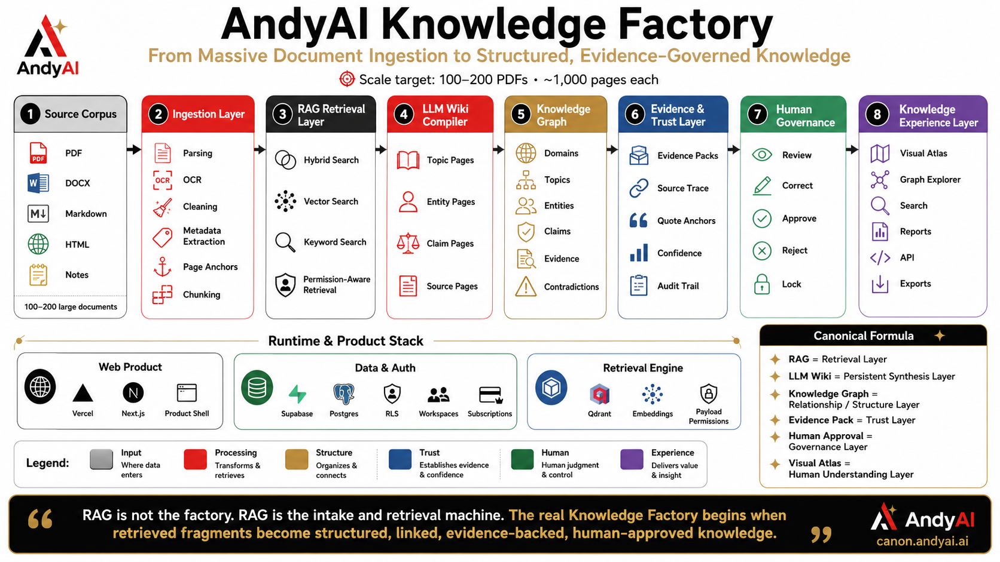

━━━━━━━━━━━━━━━━━━━━

## 🌙 Public Beta, nije metla — u mrklom mraku pali svetla

**AndyAI Knowledge Factory is not just another RAG system.**

It is a governed knowledge workflow system that turns scattered documents, policies, evidence, signals and human review into **verified, reusable and auditable knowledge**.

```text
Documents
→ Ingestion
→ KnowledgeBlocks
→ Curator Hygiene
→ Conductor Orchestration
→ Evidence Pack
→ Human Approval
→ LLM Wiki
→ Knowledge Graph
→ Public Proof
```

**Serbian canon:**

```text
Kod drugih: metla.
Kod nas: svetla.

Public beta, nije metla —
u mrklom mraku pali svetla.
```

━━━━━━━━━━━━━━━━━━━━

## 🧠 What this project does

AndyAI Knowledge Factory is a public-beta knowledge operations platform for building **trusted AI knowledge systems**.

It combines:

| Layer | Meaning |
|---|---|
| 🧱 **KnowledgeBlocks** | Structured knowledge units with question, answer, evidence, version and approval. |
| 🧹 **Curator Layer** | Freshness, duplicate detection, graph hygiene and stale knowledge reports. |
| 🎼 **Conductor Layer** | Dynamic orchestration of retrieval strategy, worker assignment, verifier and approval gate. |
| 🧾 **Evidence Pack** | Proof-first outputs, audit trail and release memory. |
| 🧑‍⚖️ **Human Approval** | Human-in-the-loop gates for trusted decisions. |
| 🕸️ **LLM Wiki + Knowledge Graph** | Public and internal knowledge surfaces that explain, link and preserve meaning. |
| 🚀 **Vercel Surface** | Public alpha/beta product routes and launch-ready pages. |
| 🟢 **Supabase Persistence** | Pilot intake, feedback, public interest and operational memory tables. |
| 🎨 **Tailwind Public Beta Glow** | Polished public UI layer with trust wall, CTA and admin review surfaces. |

━━━━━━━━━━━━━━━━━━━━

## 🏟️ Visual Atlas — stadium lights in the dark

The project includes a curated visual atlas. These diagrams are not decoration. They are **working explanations**.

| 1 | **Andyai Knowledge Factory Architecture Diagram** | `assets/canon-visuals/andyai_knowledge_factory_architecture_diagram.png` |  |
| 2 | **Andyai Knowledge Factory System Map** | `assets/canon-visuals/andyai_knowledge_factory_system_map.png` | 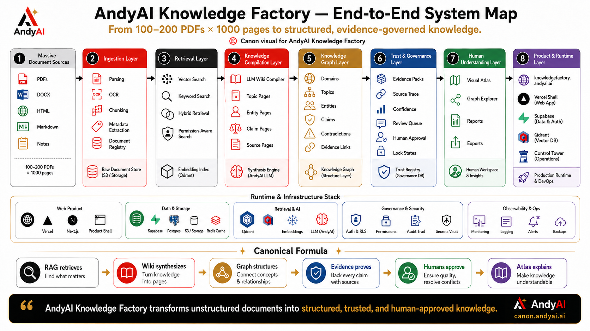 |
| 3 | **Andyai Knowledge Factory System Stack** | `assets/canon-visuals/andyai_knowledge_factory_system_stack.png` | 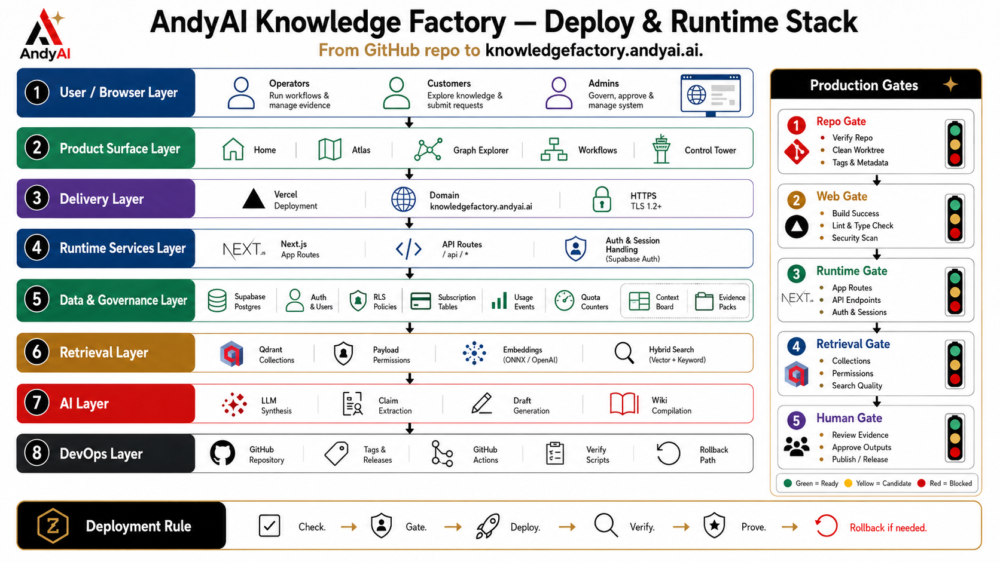 |
| 4 | **Andyai Product Surface And System Map** | `assets/canon-visuals/andyai_product_surface_and_system_map.png` | 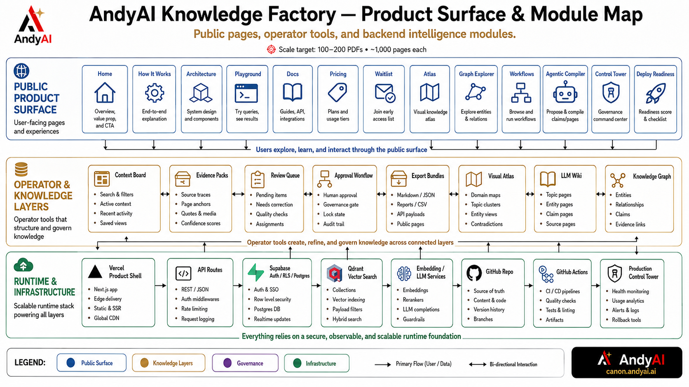 |
| 5 | **Knowledge Workflows And Production Control Tower** | `assets/canon-visuals/knowledge_workflows_and_production_control_tower.png` | 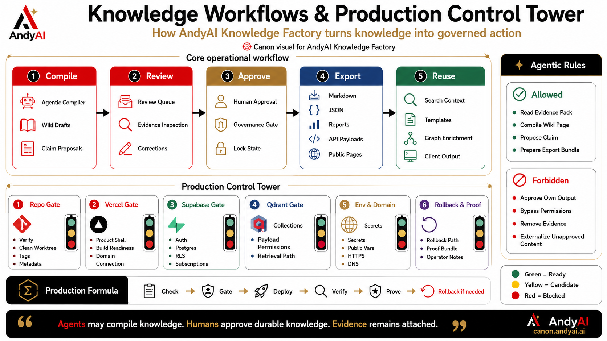 |
| 6 | **Massive Document Ingestion Pipeline Infographic** | `assets/canon-visuals/massive_document_ingestion_pipeline_infographic.png` | 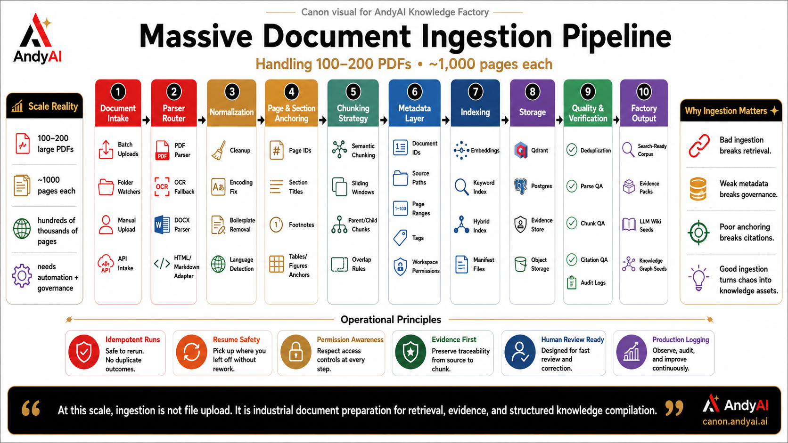 |
| 7 | **The Andyai Knowledge Governance Workflow** | `assets/canon-visuals/the_andyai_knowledge_governance_workflow.png` | 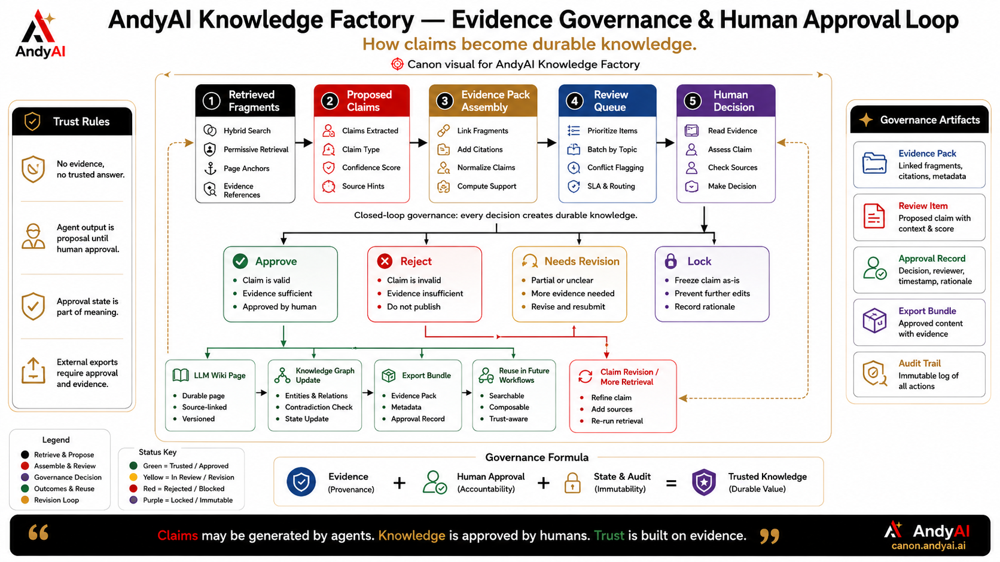 |
| 8 | **The New Rag Paradigm Flowchart** | `assets/canon-visuals/the_new_rag_paradigm_flowchart.png` | 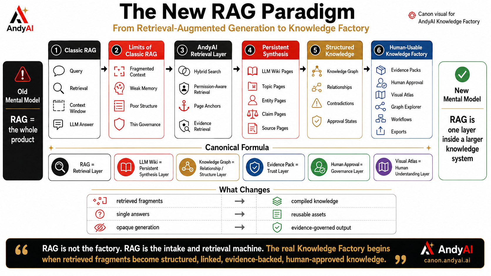 |
| 9 | **Knowledge Factory Platform Architecture Diagram** | `assets/canon-visuals/extended/knowledge_factory_platform_architecture_diagram.png` | 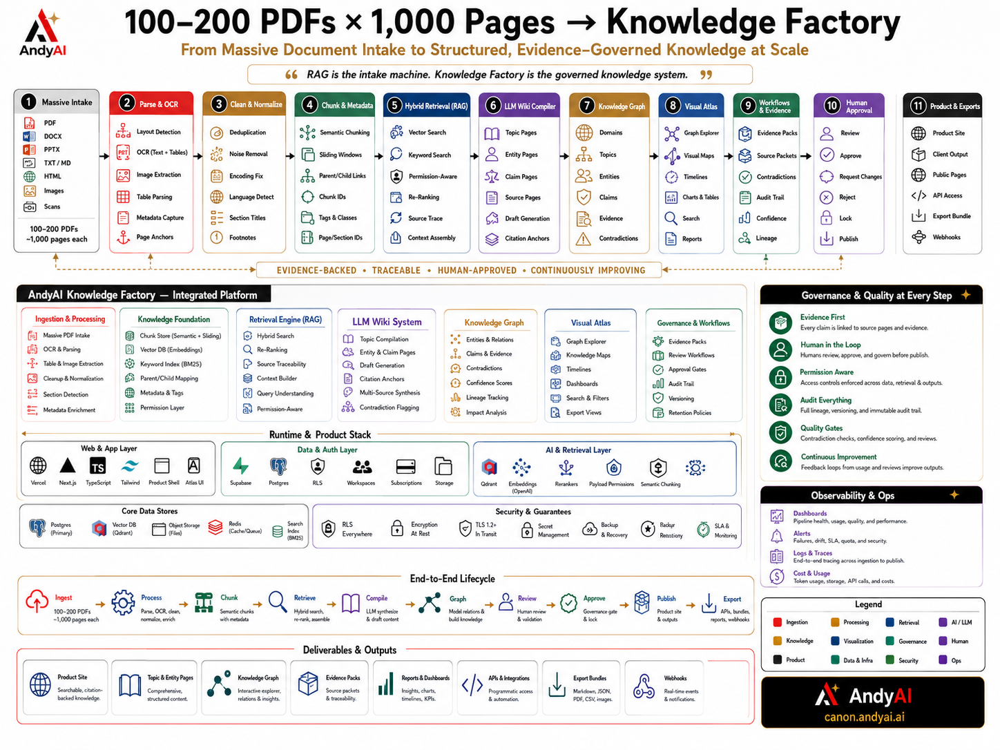 |
| 10 | **Human In The Loop Knowledge Approval Process** | `assets/canon-visuals/extended/human_in_the_loop_knowledge_approval_process.png` | 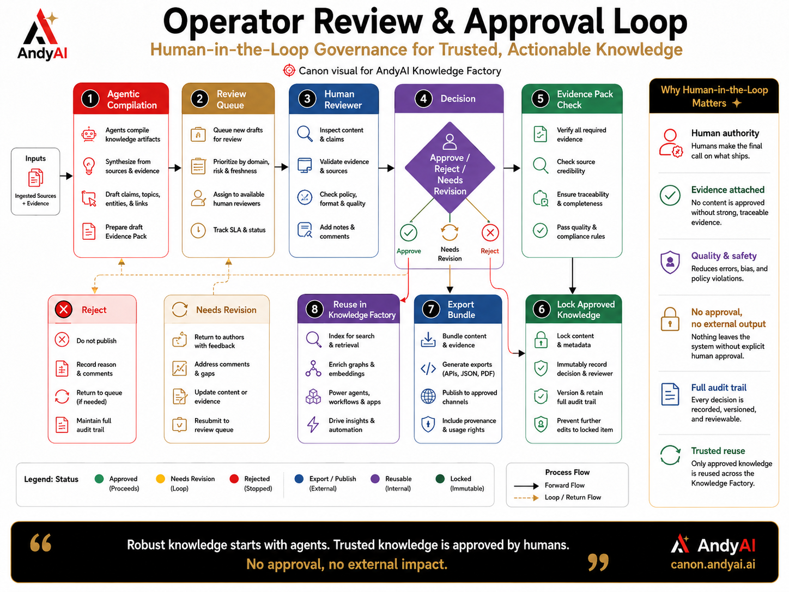 |
| 11 | **Evidence Pack Lifecycle Infographic Flowchart** | `assets/canon-visuals/extended/evidence_pack_lifecycle_infographic_flowchart.png` | 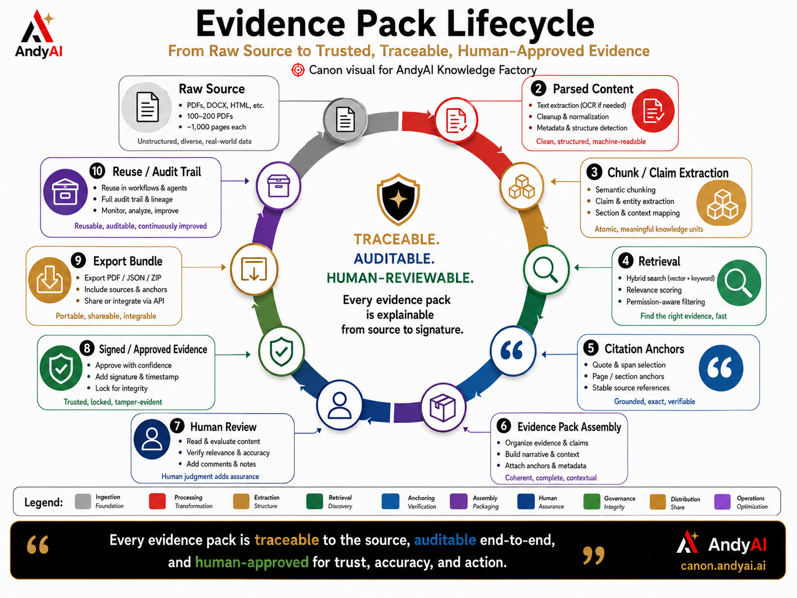 |
| 12 | **Permission Aware Access Map For Andyai** | `assets/canon-visuals/extended/permission_aware_access_map_for_andyai.png` | 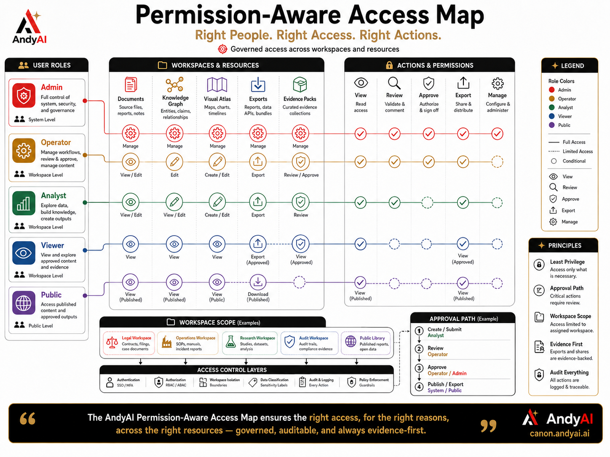 |
| 13 | **Supabase Runtime And Multi Tenant Model Overview** | `assets/canon-visuals/extended/supabase_runtime_and_multi_tenant_model_overview.png` | 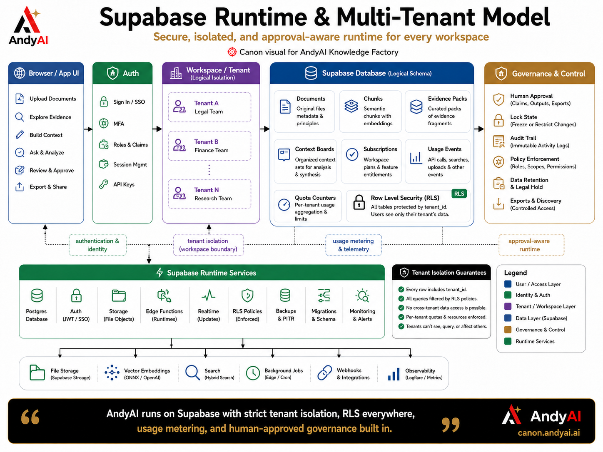 |
| 14 | **Vercel Deploy And Release Pipeline Diagram** | `assets/canon-visuals/extended/vercel_deploy_and_release_pipeline_diagram.png` | 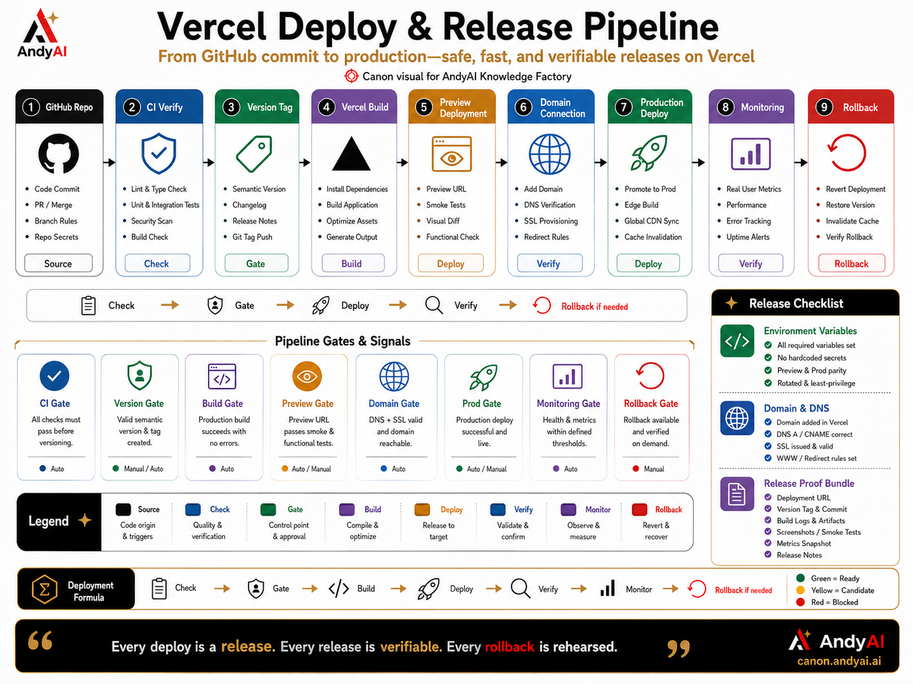 |

See also:

- [`docs/visuals/README_VISUAL_GALLERY.md`](docs/visuals/README_VISUAL_GALLERY.md)
- [`docs/architecture/MERMAID_ARCHITECTURE_SUITE.md`](docs/architecture/MERMAID_ARCHITECTURE_SUITE.md)

━━━━━━━━━━━━━━━━━━━━

## 🧭 Public beta route map

| Route | Purpose |
|---|---|
| `/public-beta` | Public beta landing surface |
| `/public-home` | Public alpha/beta home polish |
| `/public-showcase` | Product showcase |
| `/public-conductor` | Conductor public explanation |
| `/visuals/atlas` | Canon visual gallery |
| `/release-proof` | Public trust / release proof |
| `/pilot-request` | Pilot request entry |
| `/beta-feedback` | Public beta feedback |
| `/beta-pilot-request` | Public beta pilot request |
| `/beta-admin` | Admin queue surface |
| `/beta-trust-wall` | Trust and proof wall |
| `/v1-candidate` | Public Beta v1 Candidate |
| `/v1-proof` | Final proof pack |

━━━━━━━━━━━━━━━━━━━━

## 🧬 Core architecture

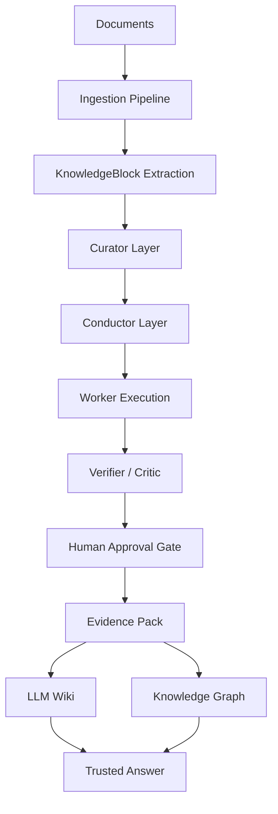

━━━━━━━━━━━━━━━━━━━━

## 🎼 Guided Knowledge Orchestration

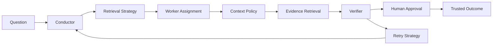

━━━━━━━━━━━━━━━━━━━━

## 🟢 Public Beta v1 Candidate

```text
POST Routes
→ Supabase Inserts
→ Protected Admin
→ RLS Audit
→ Vercel Smoke
→ Tailwind Polish
→ README Launch
→ Proof Pack
→ v1 Candidate
```

Key implemented standards:

- Real public feedback POST route contract
- Pilot request POST route contract
- Supabase insert adapter standard
- Protected admin review model
- Production RLS audit checklist
- Vercel build smoke standard
- Tailwind public beta polish pass
- Final public beta proof pack
- v100.0.0 Public Beta v1 Candidate Kernel

━━━━━━━━━━━━━━━━━━━━

## 🧪 TAP-TAP proof discipline

Every serious release follows the same AndyAI rhythm:

```text
Apply
→ Verify
→ Commit
→ Tag
→ Push
→ Metadata
→ Proof
```

This repo reached **v100.0.0** through repeatable TAP-TAP release discipline.

```text
Interno možemo biti brzi.
Eksterno moramo biti proverljivi.
```

━━━━━━━━━━━━━━━━━━━━

## 📚 Documentation map

Start here:

- [`docs/00_START_HERE.md`](docs/00_START_HERE.md)
- [`docs/public-beta-v1/README_PUBLIC_BETA_V1_OVERVIEW.md`](docs/public-beta-v1/README_PUBLIC_BETA_V1_OVERVIEW.md)
- [`docs/public-beta-v1/DOCUMENTATION_NAVIGATION_MAP.md`](docs/public-beta-v1/DOCUMENTATION_NAVIGATION_MAP.md)
- [`docs/public-beta-v1/V101_DOCUMENTATION_POLISH_KERNEL.md`](docs/public-beta-v1/V101_DOCUMENTATION_POLISH_KERNEL.md)

Architecture:

- [`docs/architecture/MERMAID_ARCHITECTURE_SUITE.md`](docs/architecture/MERMAID_ARCHITECTURE_SUITE.md)
- [`docs/visuals/README_VISUAL_GALLERY.md`](docs/visuals/README_VISUAL_GALLERY.md)

Proof and launch:

- [`docs/v1-candidate/V100_PUBLIC_BETA_V1_CANDIDATE_KERNEL.md`](docs/v1-candidate/V100_PUBLIC_BETA_V1_CANDIDATE_KERNEL.md)
- [`docs/trust/FINAL_PUBLIC_BETA_PROOF_PACK.md`](docs/trust/FINAL_PUBLIC_BETA_PROOF_PACK.md)
- [`docs/launch/V1_CANDIDATE_LAUNCH_NARRATIVE.md`](docs/launch/V1_CANDIDATE_LAUNCH_NARRATIVE.md)

━━━━━━━━━━━━━━━━━━━━

## 🏢 Enterprise translation

For regulated or document-heavy teams, such as automotive insurance:

```text
Claims Documents
→ Policy Rules
→ Evidence Checklist
→ Claim Review Skill
→ Human Approval
→ Auditable Decision
→ Trusted Knowledge Workflow
```

This is not a chatbot demo.

```text
Rapid prototype.
Clear architecture.
Visible proof.
Ready for pilot conversation.
```

━━━━━━━━━━━━━━━━━━━━

## 👤 Canonical attribution

**AndyAI — Canonical platform, system direction, and brand layer**  
**Founder:** AndyAI Andrija (Andy) Kolundzic  
**CEO and Owner, Japan IT Business, Tokyo, Japan**

━━━━━━━━━━━━━━━━━━━━

## 🟢 Status

```text
Current public milestone:
v100.0.0 — Public Beta v1 Candidate Kernel

Documentation polish milestone:
v101.0.0 — README & Documentation Polish Kernel
```


---

## v101.1.0 — Beyond RAG MCP Native Knowledge Graph Signal

Part of ASAL — AndyAI Structural Awareness Layer. AI must not only search text; AI must understand structure, flow, evidence and consequence.


---

## v101.2.0 — AndyAI Structural Awareness Layer Standard

Part of ASAL — AndyAI Structural Awareness Layer. AI must not only search text; AI must understand structure, flow, evidence and consequence.


---

## v102.0.0 — Codebase Structural Entity Model

Part of ASAL — AndyAI Structural Awareness Layer. AI must not only search text; AI must understand structure, flow, evidence and consequence.


---

## v102.1.0 — Structural Relation Edge Schema

Part of ASAL — AndyAI Structural Awareness Layer. AI must not only search text; AI must understand structure, flow, evidence and consequence.


---

## v103.0.0 — AST Parser Pipeline Contract

Part of ASAL — AndyAI Structural Awareness Layer. AI must not only search text; AI must understand structure, flow, evidence and consequence.


---

## v103.1.0 — Tree-sitter Candidate Integration Note

Part of ASAL — AndyAI Structural Awareness Layer. AI must not only search text; AI must understand structure, flow, evidence and consequence.


---

## v104.0.0 — Repo Graph Build Pipeline

Part of ASAL — AndyAI Structural Awareness Layer. AI must not only search text; AI must understand structure, flow, evidence and consequence.
