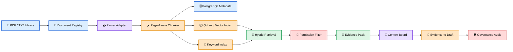

# 🧠 AndyAI RAG Ingestion Factory

> **Evidence-governed RAG ingestion factory for large PDF libraries, sovereign enterprise knowledge systems, and permission-aware retrieval.**

<p align="left">
  
  
  
  
  
  
  
</p>

---

## 🧭 What This Repo Is

**AndyAI RAG Ingestion Factory** is a production-oriented foundation for building reliable RAG systems over very large document libraries.

It is designed for scenarios such as:

- **100–200 PDFs**
- **1,000 pages per PDF**
- **100,000–200,000 total pages**
- **hundreds of thousands of searchable chunks**
- **page-level citations**
- **hybrid retrieval**
- **permission-aware access**
- **operator evidence reports**
- **sovereign enterprise deployment paths**

This is not a PDF chatbot.

This is a **document intelligence factory**.

---

## 🧠 Canonical Principle

Raw documents are **not knowledge**.

They become usable knowledge only after they pass through a governed factory:

```text
PDF → Register → Parse → Normalize → Structure → Chunk → Embed → Index → Retrieve → Cite → Audit
```

### Core Formula

```text
Parse carefully.
Chunk intelligently.
Index traceably.
Retrieve with permissions.
Rerank evidence.
Cite always.
Audit everything.
```

### Public Line

```text
We do not just answer.
We show why the answer deserves attention.
```

---

## 🏗️ Factory Architecture



---

## 🚀 Current Version — v4.1.0

**Sovereign Permission & Context Board Release**

v4.1.0 adds:

- sovereign enterprise standard
- permission-aware retrieval model
- access policy schema
- Context Board layer
- Evidence-to-Draft layer
- enterprise agent blueprint
- security modules
- README full rewrite

---

## 🔐 Permission-Aware Retrieval

A serious enterprise RAG system must not retrieve what the user is not allowed to see.

```text
No permission match, no retrieval.
```

Permission context:

```text
user_id
tenant_id
roles
clearance_level
```

Chunk policy:

```text
tenant_id
classification
allowed_roles
allowed_users
source_system
permission_source
```

---

## 🧠 Context Board

The Context Board is a structured workspace for evidence.

It is not chat history.

It contains:

- query
- selected citations
- evidence items
- approval status
- operator notes
- draft outputs
- review history

Formula:

```text
Retrieval finds fragments.
Context Board organizes evidence.
Human turns evidence into judgment.
```

---

## 📝 Evidence-to-Draft

The repo can now turn evidence packs into controlled Markdown drafts.

Rule:

```text
Draft must cite evidence.
No citation, no enterprise draft.
```

---

## 🧪 Quick Commands

Verify:

```bash
./scripts/verify.sh
```

Run ingestion:

```bash
PYTHONPATH=src python3 -m rag_ingestion_factory.cli.main ingest examples/sample_documents/demo_document.txt --out examples/output/text_run
```

Run evidence demo:

```bash
PYTHONPATH=src python3 -m rag_ingestion_factory.cli.main evidence-demo examples/sample_documents/demo_document.txt "What does the ingestion pipeline prepare?"
```

Run operator console:

```bash
./scripts/run_operator_console_demo.sh
```

Run Context Board demo:

```bash
PYTHONPATH=src python3 -m rag_ingestion_factory.cli.main context-board-demo examples/sample_documents/demo_document.txt "What does the ingestion pipeline prepare?"
```

Run draft demo:

```bash
PYTHONPATH=src python3 -m rag_ingestion_factory.cli.main draft-demo examples/sample_documents/demo_document.txt "What does the ingestion pipeline prepare?"
```

Run permission demo:

```bash
PYTHONPATH=src python3 -m rag_ingestion_factory.cli.main permission-demo examples/sample_documents/demo_document.txt "What does the ingestion pipeline prepare?"
```

---

## 🐳 Production Bridge

Start local infrastructure:

```bash
docker compose up -d
```

Services:

```text
Qdrant:     http://localhost:6333
PostgreSQL: localhost:5432
```

---

## 🧱 Layer Roadmap

```text
v1.x  Core ingestion, parser, metadata
v2.0  Governed RAG ingestion architecture
v3.0  Production bridge with Docker, API, batch jobs
v4.0  Operator Evidence Console
v4.1  Sovereign permissions + Context Board
v4.2  Qdrant payload permission filters
v4.3  Context Board persistence
v4.4  Evidence-to-Draft templates
v5.0  Sovereign Enterprise RAG Factory ✅
```

---

## 📁 Repo Structure

```text
docs/
  23-sovereign/
  24-security/
  25-context-board/
  26-drafting/
  27-agents/
schemas/
src/rag_ingestion_factory/
  adapters/
  api/
  config/
  context_board/
  core/
  drafting/
  embeddings/
  evidence/
  governance/
  indexes/
  jobs/
  operator/
  retrieval/
  security/
tests/
scripts/
docker-compose.yml
```

---

## 🛡️ Governance Rules

- never lose document identity
- never lose page identity
- never lose chunk identity
- never skip manifests
- never retrieve across unauthorized permission boundaries
- never draft without citations
- never hide weak evidence
- never present generated text as verified truth

---


---

## 🔐 v4.2.0 — Qdrant Payload Permission Filters

v4.2.0 prepares permission-aware retrieval at the vector payload level.

Canonical rule:

```text
Permission filtering after generation is too late.
Permissions must shape retrieval before context reaches the model.
```


---

## 🧠 v4.3.0 — Context Board Persistence

v4.3.0 saves Context Boards as reusable evidence workspaces.

Canonical rule:

```text
If evidence shaped a decision, the board must be saved.
```


---

## 📝 v4.4.0 — Evidence-to-Draft Templates

v4.4.0 adds deterministic templates:

```text
executive_brief
technical_summary
operator_report
client_explanation
```

Canonical rule:

```text
Drafts may be polished later.
But first they must be evidence-grounded.
```


---

## 🌐 v4.5.0 — External Service Gateway

v4.5.0 defines the external gateway policy.

Canonical rule:

```text
External agents access approved evidence, not raw private memory.
```


---

## 🏛️ v5.0.0 — Sovereign Enterprise RAG Factory

v5.0.0 completes the first sovereign enterprise architecture arc.

The repo now includes:

- sovereign deployment standard
- permission-aware retrieval
- Qdrant payload permission filters
- Context Board
- Context Board persistence
- Evidence-to-Draft templates
- External Service Gateway
- Operator Evidence Console
- production bridge
- governance audit

v5 formula:

```text
Data stays inside.
Permissions shape retrieval.
Evidence becomes context.
Context becomes draft.
Draft remains cited.
Agents carry proof.
Humans approve external use.
```

Public message:

```text
This is not a chatbot.
This is a sovereign evidence-governed knowledge factory.
```


---

## 🔐 v5.1.0 — Live Qdrant Permission Demo

v5.1.0 adds a safe bridge toward live Qdrant permission filtering.

```text
PermissionContext → Qdrant filter payload → vector boundary → evidence pack
```


---

## 🗄️ v5.2.0 — PostgreSQL Runtime Adapter

v5.2.0 adds production-shaped SQL statement builders for runtime persistence.

```text
Vector DB searches.
PostgreSQL remembers.
Evidence proves.
```


---

## ✅ v5.3.0 — Approval Workflow

v5.3.0 adds human approval decisions.

```text
Agents prepare.
Humans approve.
Evidence remains attached.
```


---

## 🔏 v5.4.0 — Signed Evidence Bundle

v5.4.0 adds deterministic evidence hashing.

```text
Evidence that shaped a decision must be tamper-evident.
```


---

## 📊 v5.5.0 — Evaluation Bench

v5.5.0 adds simple evidence evaluation metrics.

```text
A RAG factory must measure retrieval, not only celebrate answers.
```


---

## ⚙️ v6.0.0 — Runtime Service

v6.0.0 defines the runtime service boundary.

```text
Library becomes service only when runtime boundaries are explicit.
```


---

## 🏢 v7.0.0 — Multi-Tenant Governance

v7.0.0 defines tenant isolation boundaries.

```text
No tenant boundary, no enterprise RAG.
```


---

## 📡 v8.0.0 — Observability Dashboard

v8.0.0 adds operator observability snapshots.

```text
If operators cannot see the factory, they cannot govern the factory.
```


---

## 🏷️ v9.0.0 — Release Factory Automation

v9.0.0 defines release manifest discipline.

```text
Release is not a tag.
Release is proof plus version plus rollback path.
```


---

## 🧠 v10.0.0 — Sovereign Knowledge OS Canon Lock

v10.0.0 locks the first complete canon.

```text
Ingest.
Structure.
Permission.
Retrieve.
Evidence.
Context.
Draft.
Approve.
Externalize.
Observe.
Release.
Govern.
```

Public message:

```text
This is not a chatbot.
This is a sovereign knowledge factory with evidence, permissions, and governance.
```


---

## 🧃 v10.1.0 — Canon Recap & Public Product Bridge

v10.1.0 locks the public product direction.

```text
Product: AndyAI Knowledge Factory
Site:    knowledgefactory.andyai.ai
Repo:    andyai-rag-ingestion-factory
```

Origin story:

```text
It started with a simple question:
How do we ingest 100–200 PDFs, each with 1,000 pages?

It became AndyAI Knowledge Factory.
```

Product formula:

```text
Recap the factory.
Explain the value.
Show the product.
Prepare the web surface.
Prepare the runtime backend.
Prepare the subscription path.
Open the road to v20.
```

Next public product arc:

```text
v10.2.0 — Vercel Product Shell
v10.3.0 — Supabase Runtime Schema
v10.4.0 — Auth + RLS Permission Model
v10.5.0 — Public RAG Playground MVP
v11.0.0 — Runtime API + Web Demo Release
```


---

## 🌐 v10.2.0 — Vercel Product Shell

v10.2.0 adds the first public web product shell for:

```text
AndyAI Knowledge Factory
knowledgefactory.andyai.ai
```

App path:

```text
apps/knowledgefactory-web
```

Pages:

```text
/
 /how-it-works
 /architecture
 /playground
 /operator-console
 /context-board
 /pricing
 /waitlist
 /docs
```

Product line:

```text
Evidence-governed RAG for serious document intelligence.
```

Deployment rule:

```text
Deploy the shell first.
Connect runtime second.
```


---

## 🗄️ v10.3.0 — Supabase Runtime Schema

v10.3.0 adds the first Supabase runtime schema for:

```text
AndyAI Knowledge Factory
knowledgefactory.andyai.ai
```

Runtime tables:

```text
profiles
workspaces
workspace_members
documents
ingestion_runs
chunks_metadata
evidence_packs
context_boards
drafts
approval_decisions
subscription_plans
subscriptions
usage_events
quota_counters
```

Canonical rule:

```text
Supabase stores product runtime truth.
The repository stores engineering canon.
```

Next:

```text
v10.4.0 — Auth + RLS Permission Model
```


---

## 🔐 v10.4.0 — Auth + RLS Permission Model

v10.4.0 hardens the Supabase permission model.

```text
auth.uid()
→ workspace_members
→ workspace_id
→ table access
```

Canonical rule:

```text
No RLS, no multi-tenant production.
```


---

## 🧪 v10.5.0 — Public RAG Playground MVP

v10.5.0 creates the first public demo surface.

```text
demo query
→ evidence pack
→ citations panel
→ public explanation
```

Rule:

```text
The playground must always show citations.
```


---

## 🌐 v11.0.0 — Runtime API + Web Demo Release

v11.0.0 adds product API endpoints:

```text
/api/health
/api/runtime/status
/api/playground/demo
/api/evidence/demo
/api/context-board/demo
/api/qdrant/demo
```

Rule:

```text
API endpoints must return evidence metadata, not only generated text.
```


---

## 📦 v12.0.0 — Live Qdrant Pipeline

v12.0.0 defines the live vector retrieval path.

```text
embedding provider
→ Qdrant collection
→ payload permissions
→ vector search
→ hybrid merge
→ evidence pack
```

Rule:

```text
Permissions shape vector retrieval before context reaches the model.
```


---

## 🧬 v13.0.0 — Knowledge Graph & LLM Wiki Compiler Layer

v13.0.0 upgrades AndyAI Knowledge Factory from retrieval-first RAG into structured knowledge compilation.

```text
RAG = Retrieval Layer
LLM Wiki = Persistent Synthesis Layer
Knowledge Graph = Relationship / Structure Layer
Evidence Pack = Trust Layer
Human Approval = Governance Layer
Visual Atlas = Human Understanding Layer
```

Canonical rule:

```text
RAG is not the factory.
RAG is the intake and retrieval machine.
The real Knowledge Factory begins when retrieved fragments become structured, linked, evidence-backed, human-approved knowledge.
```

Public product copy:

```text
AndyAI Knowledge Factory does not stop at retrieval.
It compiles documents into a persistent, structured, evidence-governed knowledge graph that humans can inspect, correct, approve, and reuse.
```

Next:

```text
v14.0.0 — Visual Atlas & Graph Explorer
```


---

## 🗺️ v14.0.0 — Visual Atlas & Graph Explorer

v14.0.0 turns structured knowledge into a visible human interface.

```text
Knowledge Graph = structure
Visual Atlas = understanding
Graph Explorer = interaction
Evidence Overlay = trust visibility
Approval Overlay = governance visibility
Contradiction Map = uncertainty visibility
```

Canonical rule:

```text
Structured knowledge should be visible, not only searchable.
```

Public product meaning:

```text
AndyAI Knowledge Factory now helps humans see domains, topics, entities, claims, evidence, and approval states as an atlas and explorer layer.
```

Next:

```text
v15.0.0 — Knowledge Workflows & Agentic Compilation
```


---

## ⚙️ v15.0.0 — Knowledge Workflows & Agentic Compilation

v15.0.0 turns visible knowledge into governed workflows.

```text
Compile
→ Review
→ Approve
→ Export
→ Reuse
```

Canonical rule:

```text
Agents may compile knowledge.
Humans approve durable knowledge.
Evidence remains attached.
```

Public product meaning:

```text
AndyAI Knowledge Factory does not only search documents.
It helps teams compile, review, approve, export, and reuse evidence-backed knowledge.
```

Next:

```text
v16.0.0 — Production Deploy Control Tower
```


---

## 🗼 v16.0.0 — Production Deploy Control Tower

v16.0.0 introduces production readiness governance for AndyAI Knowledge Factory.

```text
Check.
Gate.
Deploy.
Verify.
Prove.
Rollback if needed.
Record the release.
```

Control tower areas:

```text
Vercel readiness
Supabase readiness
Qdrant readiness
environment variables
domain checklist
security gates
deploy gates
rollback plan
production proof bundle
release runway
```

Canonical rule:

```text
No production deploy without readiness gates, rollback path, and proof bundle.
```

Next:

```text
v16.1.0 — Vercel Build Verification
```


---

## 🖼️ v16.1.0 — Canon Visual Pack Integration

v16.1.0 integrates the first canon.andyai.ai visual set directly into the repo and product shell.

```text
Knowledge Factory Architecture
Massive Document Ingestion Pipeline
The New RAG Paradigm
Knowledge Workflows & Production Control Tower
Knowledge Governance Workflow
Knowledge Factory System Stack
Knowledge Factory System Map
Product Surface & System Map
```

Canonical rule:

```text
Before production deploy, the factory must be explainable at a glance.
```

Next:

```text
v16.2.0 — Extended Canon Visual Series
```


---

## 🖼️ v16.2.0 — Extended Canon Visual Series

v16.2.0 adds the second wave of canon.andyai.ai visuals focused on the most important product layers.

```text
Operator Review & Approval Loop
Supabase Runtime & Multi-Tenant Model
Vercel Deploy & Release Pipeline
Evidence Pack Lifecycle
Permission-Aware Access Map
100-200 PDFs x 1,000 Pages -> Knowledge Factory
```

Canonical rule:

```text
Every important product layer should be visually explainable.
```

Next:

```text
v16.3.0 — Visual Atlas Product Demo Layer
```


---

## 🧪 v16.3.0 — Self-Hosted Retrieval Lab Signal

v16.3.0 integrates the DeepSeek V4 + TurboVec + RAG signal as a local retrieval lab direction.

```text
PDF / OCR / Documents
→ Text Extraction
→ Chunking
→ Embeddings
→ Vector Index / TurboVec / Qdrant / pgvector / FAISS / LanceDB
→ Retrieval
→ Evidence Pack
→ LLM Wiki
→ Knowledge Graph
→ Human Approval
→ Canonical Knowledge
```

Canonical sentence:

```text
RAG finds fragments.
Knowledge Factory turns them into proven, linked, approved knowledge.
```

Serbian:

```text
RAG pronalazi fragmente.
Knowledge Factory ih pretvara u dokazano, povezano i odobreno znanje.
```

Next:

```text
v16.4.0 — Local Retrieval Adapter Prototype
```


---

## 🧹 v16.3.1 — Visual Asset Scope Cleanup

v16.3.1 cleans the accidental extra PNG copy from v16.2.0.

Canonical rule:

```text
Visual assets must be curated, not swept.
```

Permanent lesson:

```text
Never copy *.png from Downloads.
Always copy an explicit allowlist.
```

Next:

```text
v16.4.0 — Local Retrieval Adapter Prototype
```


---

## 🖼️ v16.4.0 — Canon Visual Master Atlas

v16.4.0 turns the existing 14 curated diagrams into a formally indexed, allowlisted, product-facing visual atlas.

```text
8 base canon visuals
6 extended canon visuals
14 total official diagrams
```

The atlas is available in the product shell at:

```text
/visuals/atlas
```

Canonical rule:

```text
Before production deploy, the factory must be explainable at a glance.
```

Permanent visual discipline:

```text
Slike se ne kupe metlom — slike se biraju pincetom.
```

English:

```text
Images are not swept in with a broom — they are selected with tweezers.
```

Next:

```text
v16.5.0 — Visual Atlas Product Demo Layer
```


---

## 🖼️ v16.5.0 — Visual Atlas Product Demo Layer

v16.5.0 turns the Visual Atlas from a static gallery into a guided product explanation layer.

```text
14 official diagrams
14 textual legends
1 guided story flow
1 product demo page
1 demo API payload
```

Product demo route:

```text
/visuals/demo
```

API route:

```text
/api/canon-visuals/demo-layer
```

Canonical rule:

```text
The visual atlas is not a gallery. It is the product explanation engine.
```

Serbian:

```text
Vizuelni atlas nije galerija. On je motor za objašnjavanje proizvoda.
```

Permanent visual discipline:

```text
Slike se ne kupe metlom — slike se biraju pincetom.
```

Next:

```text
v16.6.0 — Visual Atlas Interactive Story Mode
```


---

## 🖼️ v16.6.0 — Visual Atlas Interactive Story Mode

v16.6.0 turns the Visual Atlas Product Demo Layer into a step-by-step guided product story.

```text
10 story steps
14 protected diagrams
14 textual legends
1 interactive story route
1 story-mode API payload
```

Story route:

```text
/visuals/story
```

API route:

```text
/api/canon-visuals/story-mode
```

Canonical rule:

```text
A serious product should not only show its architecture — it should guide the user through it.
```

Serbian:

```text
Ozbiljan proizvod ne treba samo da pokaže arhitekturu — treba da provede čoveka kroz nju.
```

Next:

```text
v16.7.0 — Visual Atlas Client Pitch Mode
```


---

## 🖼️ v16.7.0 — Visual Atlas Client Pitch Mode

v16.7.0 turns the Visual Atlas Interactive Story Mode into a client-facing pitch layer.

```text
client pitch route
client pitch API
executive summary
pilot offer copy
meeting demo script
client FAQ
pitch copy bank
```

Route:

```text
/client-pitch
```

API route:

```text
/api/canon-visuals/client-pitch
```

Canonical rule:

```text
The atlas teaches the product; the pitch mode sells the value.
```

Serbian:

```text
Atlas objašnjava proizvod; pitch mode objašnjava zašto vredi.
```

Next:

```text
v16.8.0 — Pilot Request Conversion Layer
```


---

## 🧯 v16.7.1 — Client Pitch Verify Rescue

v16.7.1 rescues and completes the Client Pitch Mode after v16.7.0 stopped during verification.

```text
/client-pitch
/api/canon-visuals/client-pitch
executive summary
pilot offer copy
meeting demo script
client FAQ
pitch copy bank
```

Canonical rule:

```text
The atlas teaches the product; the pitch mode sells the value.
```

Next:

```text
v16.8.0 — Pilot Request Conversion Layer
```


---

## 🛫 v16.8.0 — Pilot Request Conversion Layer

v16.8.0 turns Client Pitch Mode into a concrete pilot-request conversion path.

```text
/pilot-request
/api/pilot-request/demo
pilot request schema
qualification result schema
pilot success metrics
conversion copy bank
```

Canonical rule:

```text
A pitch without a pilot path is only a presentation.
```

Serbian:

```text
Pitch bez pilot puta je samo prezentacija.
```

Next:

```text
v16.9.0 — Pilot Intake Admin Review Layer
```


---

## 🛂 v16.9.0 — Pilot Intake Admin Review Layer

v16.9.0 adds an operator/admin console for reviewing incoming pilot requests.

```text
/pilot-admin
/api/pilot-request/admin-demo
admin queue schema
review decision model
operator playbook
admin review copy bank
sample queue payload
```

Canonical rule:

```text
A pilot request is not complete when it is submitted. It is complete when an operator can review it, score it, and decide the next action.
```

Serbian:

```text
Pilot zahtev nije završen kad je poslat. Završen je kad operator može da ga pregleda, oceni i odredi sledeći potez.
```

Next:

```text
v17.0.0 — Supabase Pilot Request Persistence
```


---

## 🗄️ v17.0.0 — Supabase Pilot Request Persistence

v17.0.0 moves pilot requests from demo objects toward real Supabase persistence.

```text
public.pilot_requests
Supabase migration
seed data
demo RLS policies
runtime adapter
/pilot-admin/persistence
/api/pilot-request/persistence-demo
```

Canonical rule:

```text
A pilot request becomes operational only when it can be stored, reviewed, protected, and followed up.
```

Serbian:

```text
Pilot zahtev postaje operativan tek kada može da se sačuva, pregleda, zaštiti i prati dalje.
```

Production warning:

```text
Demo RLS policies are for lab testing only. Production requires tenant-bound policies.
```

Next:

```text
v17.1.0 — Supabase Client Runtime Wiring
```


---

## 🧯 v17.0.1 — Supabase Persistence Verify Rescue

v17.0.1 rescues the Supabase Pilot Request Persistence release by fixing the Python smoke-test import path.

```text
Root cause: Python smoke test lacked PYTHONPATH=src
Fix: PYTHONPATH=src python3 ...
```

Persistence scope:

```text
public.pilot_requests
Supabase migration
seed data
demo RLS policies
runtime adapter
/pilot-admin/persistence
/api/pilot-request/persistence-demo
```

Canonical rule:

```text
A pilot request becomes operational only when it can be stored, reviewed, protected, and followed up.
```

Next:

```text
v17.1.0 — Supabase Client Runtime Wiring
```


---

## 🔌 v17.1.0 — Supabase Client Runtime Wiring

v17.1.0 adds the runtime bridge between the Vercel product surface and the Supabase persistence layer.

```text
/pilot-admin/runtime
/api/pilot-request/runtime-demo
safe mock fallback
Supabase env standard
runtime adapter contract
Vercel env checklist
```

Canonical rule:

```text
Persistence is the table. Runtime wiring is the bridge between product and database.
```

Serbian:

```text
Persistence je tabela. Runtime wiring je most između proizvoda i baze.
```

Required env:

```text
NEXT_PUBLIC_SUPABASE_URL
NEXT_PUBLIC_SUPABASE_ANON_KEY
```

Next:

```text
v17.2.0 — Pilot Create/List API Route Scaffolding
```


## 👨‍💻 Founder

# 🧠 AndyAI

## Canonical AI platform, system direction, and brand layer

👨‍💻 **Founder**  
Andrija (Andy) Kolundzic

🏢 **Japan IT Business**  
CEO and Owner

📍 **Tokyo, Japan**


---

## 🛣️ v17.2.0 — Pilot Create/List API Route Scaffolding

Adds API traffic lanes for pilot requests: create, list, and summary.

```text
POST /api/pilot-request/create
GET  /api/pilot-request/list
GET  /api/pilot-request/summary
```

Canonical rule:

```text
Runtime wiring connects the bridge. API routes define the traffic lanes.
```


---

## 📝 v17.3.0 — Admin Review Actions Persistence

Adds review status action model and `PATCH /api/pilot-request/review` scaffold.

```text
A review panel is not operational until decisions can be recorded.
```


---

## 🧾 v17.4.0 — Pilot Review Audit Trail

Adds traceability for review status changes.

```text
If a business decision changes state, the trace must survive the moment.
```


---

## 🔐 v18.0.0 — Supabase Production Hardening Layer

Adds production-aware RLS/security standards.

```text
Demo RLS lets the lab breathe. Production RLS lets the business survive.
```


---

## 📄 v18.1.0 — Pilot Proposal Generator

Turns qualified pilot requests into structured proposals.

```text
A qualified pilot request should become a proposal, not another loose conversation.
```


---

## ✉️ v18.2.0 — Client Follow-Up Draft Layer

Generates follow-up drafts from review decisions.

```text
The review is internal. The follow-up turns it into client movement.
```


---

## 📊 v18.3.0 — Pilot Ops Dashboard

Adds unified dashboard for pilot intake operations.

```text
A factory needs a dashboard, not scattered windows.
```


---

## 🏭 v19.0.0 — Knowledge Factory Pilot System Command Center

Locks the pilot/subscription/business intake system as a production-readiness milestone.

```text
/client-pitch → /pilot-request → /pilot-admin → /pilot-admin/persistence → /pilot-admin/runtime → /pilot-ops-dashboard → /command-center
```

Canonical rule:

```text
The pilot system is no longer a form. It is a governed business intake machine.
```


---

## 🧱 v20.0.0 — KnowledgeBlock Standard

A chunk is a fragment. A KnowledgeBlock is a governed unit of knowledge.


---

## 📐 v20.1.0 — KnowledgeBlock Schema + Examples

A KnowledgeBlock must be readable by humans and enforceable by machines.


---

## 🧯 v20.2.0 — Chunk Failure & RAG Noise Map

Most RAG failures are not retrieval failures. They are knowledge-unit failures.


---

## 🧪 v20.3.0 — Knowledge Distillation Layer Spec

Distillation is the moment when retrieved text becomes structured knowledge.


---

## 🧬 v20.4.0 — Near-Duplicate Clustering Policy

Duplicates inflate the corpus. Clusters reveal the knowledge.


---

## 🧲 v20.5.0 — Canonical Merge Policy

A merge is not deletion. A merge is controlled knowledge compression.


---

## 🛡️ v20.6.0 — Governance-Attached KnowledgeBlocks

Knowledge without governance becomes risk.


---

## 📎 v20.7.0 — Evidence-Attached KnowledgeBlocks

A KnowledgeBlock without evidence is only a polished guess.


---

## 👤 v20.8.0 — Human Review Queue for KnowledgeBlocks

AI can propose knowledge. Humans approve canon.


---

## 📤 v20.9.0 — KnowledgeBlock Export Adapter

A KnowledgeBlock is useful only when it can travel safely across systems.


---

## 🧼 v21.0.0 — Vector Store Clean Surface Model

The vector store should index governed knowledge, not uncontrolled noise.


---

## 📚 v21.1.0 — KnowledgeBlock → LLM Wiki Compiler Bridge

The wiki is not written from chunks. It is compiled from approved KnowledgeBlocks.


---

## 🕸️ v21.2.0 — KnowledgeBlock → Knowledge Graph Bridge

KnowledgeBlocks are the bricks. The Knowledge Graph is the structure.


---

## 📏 v21.3.0 — KnowledgeBlock Benchmark Harness

External benchmark numbers are signals. Local evidence decides.


---

## 🎛️ v22.0.0 — Knowledge Distillation Command Layer

A factory needs commands for turning fragments into canon.


---

## ✅ v23.0.0 — Knowledge Quality Control Layer

Knowledge quality is not decoration. It is the safety system of the factory.


---

## 🏗️ v24.0.0 — KnowledgeBlock Production Pipeline

A Knowledge Factory is real when the pipeline can repeat the same discipline every time.


---

## 🧠 v25.0.0 — Sovereign KnowledgeBlock Factory

RAG finds fragments. KnowledgeBlock distillation creates trusted knowledge. Knowledge Factory turns that knowledge into wiki, graph, evidence, and action.


---

## 🖼️ v25.1.0 — Canon Strategic Visual Integration Layer

Adds 10 strategic canon visuals with legends, repo mapping, Vercel page, and API route.


---

## 🌌 v25.2.0 — Karpathy LLM Wiki Bridge & AdAstraNova Integration Map

Connects KnowledgeBlock Factory with LLM Wiki, AdAstraNova/BEYOND, query save-back, context farmer, and future WikiPress productization.


---

## 🧭 v26.0.0 — WikiPress Product Bridge & Strategic Launch Pack

Locks the engine-memory-showcase-product map: Knowledge Factory → LLM Wiki → AdAstraNova / BEYOND → WikiPress.


---

## 🧲 v26.1.0 — WikiPress Offer & Landing Structure

Defines the offer, audiences, tiers, pilot copy, landing copy, API route, and product page for AndyAI WikiPress.


---

## 🧩 v27.0.0 — WikiPress Workspace & Project Model

Adds workspace/project schemas, role model, Supabase RLS plan, examples, Vercel page, and demo API.


---

## 🚀 v28.0.0 — WikiPress Publishing Pipeline

Adds publish job model, private/public/hybrid publishing plan, audit snapshot model, Vercel page, and API route.
