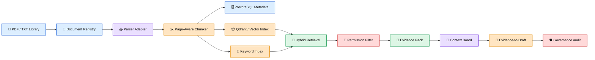

# 🧠 AndyAI RAG Ingestion Factory

> **Evidence-governed RAG ingestion factory for large PDF libraries, sovereign enterprise knowledge systems, and permission-aware retrieval.**

<p align="left">
  
  
  
  
  
  
  
</p>

---

## 🧭 What This Repo Is

**AndyAI RAG Ingestion Factory** is a production-oriented foundation for building reliable RAG systems over very large document libraries.

It is designed for scenarios such as:

- **100–200 PDFs**
- **1,000 pages per PDF**
- **100,000–200,000 total pages**
- **hundreds of thousands of searchable chunks**
- **page-level citations**
- **hybrid retrieval**
- **permission-aware access**
- **operator evidence reports**
- **sovereign enterprise deployment paths**

This is not a PDF chatbot.

This is a **document intelligence factory**.

---

## 🧠 Canonical Principle

Raw documents are **not knowledge**.

They become usable knowledge only after they pass through a governed factory:

```text
PDF → Register → Parse → Normalize → Structure → Chunk → Embed → Index → Retrieve → Cite → Audit
```

### Core Formula

```text
Parse carefully.
Chunk intelligently.
Index traceably.
Retrieve with permissions.
Rerank evidence.
Cite always.
Audit everything.
```

### Public Line

```text
We do not just answer.
We show why the answer deserves attention.
```

---

## 🏗️ Factory Architecture



---

## 🚀 Current Version — v4.1.0

**Sovereign Permission & Context Board Release**

v4.1.0 adds:

- sovereign enterprise standard
- permission-aware retrieval model
- access policy schema
- Context Board layer
- Evidence-to-Draft layer
- enterprise agent blueprint
- security modules
- README full rewrite

---

## 🔐 Permission-Aware Retrieval

A serious enterprise RAG system must not retrieve what the user is not allowed to see.

```text
No permission match, no retrieval.
```

Permission context:

```text
user_id
tenant_id
roles
clearance_level
```

Chunk policy:

```text
tenant_id
classification
allowed_roles
allowed_users
source_system
permission_source
```

---

## 🧠 Context Board

The Context Board is a structured workspace for evidence.

It is not chat history.

It contains:

- query
- selected citations
- evidence items
- approval status
- operator notes
- draft outputs
- review history

Formula:

```text
Retrieval finds fragments.
Context Board organizes evidence.
Human turns evidence into judgment.
```

---

## 📝 Evidence-to-Draft

The repo can now turn evidence packs into controlled Markdown drafts.

Rule:

```text
Draft must cite evidence.
No citation, no enterprise draft.
```

---

## 🧪 Quick Commands

Verify:

```bash
./scripts/verify.sh
```

Run ingestion:

```bash
PYTHONPATH=src python3 -m rag_ingestion_factory.cli.main ingest examples/sample_documents/demo_document.txt --out examples/output/text_run
```

Run evidence demo:

```bash
PYTHONPATH=src python3 -m rag_ingestion_factory.cli.main evidence-demo examples/sample_documents/demo_document.txt "What does the ingestion pipeline prepare?"
```

Run operator console:

```bash
./scripts/run_operator_console_demo.sh
```

Run Context Board demo:

```bash
PYTHONPATH=src python3 -m rag_ingestion_factory.cli.main context-board-demo examples/sample_documents/demo_document.txt "What does the ingestion pipeline prepare?"
```

Run draft demo:

```bash
PYTHONPATH=src python3 -m rag_ingestion_factory.cli.main draft-demo examples/sample_documents/demo_document.txt "What does the ingestion pipeline prepare?"
```

Run permission demo:

```bash
PYTHONPATH=src python3 -m rag_ingestion_factory.cli.main permission-demo examples/sample_documents/demo_document.txt "What does the ingestion pipeline prepare?"
```

---

## 🐳 Production Bridge

Start local infrastructure:

```bash
docker compose up -d
```

Services:

```text
Qdrant:     http://localhost:6333
PostgreSQL: localhost:5432
```

---

## 🧱 Layer Roadmap

```text
v1.x  Core ingestion, parser, metadata
v2.0  Governed RAG ingestion architecture
v3.0  Production bridge with Docker, API, batch jobs
v4.0  Operator Evidence Console
v4.1  Sovereign permissions + Context Board
v4.2  Qdrant payload permission filters
v4.3  Context Board persistence
v4.4  Evidence-to-Draft templates
v5.0  Sovereign Enterprise RAG Factory ✅
```

---

## 📁 Repo Structure

```text
docs/
  23-sovereign/
  24-security/
  25-context-board/
  26-drafting/
  27-agents/
schemas/
src/rag_ingestion_factory/
  adapters/
  api/
  config/
  context_board/
  core/
  drafting/
  embeddings/
  evidence/
  governance/
  indexes/
  jobs/
  operator/
  retrieval/
  security/
tests/
scripts/
docker-compose.yml
```

---

## 🛡️ Governance Rules

- never lose document identity
- never lose page identity
- never lose chunk identity
- never skip manifests
- never retrieve across unauthorized permission boundaries
- never draft without citations
- never hide weak evidence
- never present generated text as verified truth

---


---

## 🔐 v4.2.0 — Qdrant Payload Permission Filters

v4.2.0 prepares permission-aware retrieval at the vector payload level.

Canonical rule:

```text
Permission filtering after generation is too late.
Permissions must shape retrieval before context reaches the model.
```


---

## 🧠 v4.3.0 — Context Board Persistence

v4.3.0 saves Context Boards as reusable evidence workspaces.

Canonical rule:

```text
If evidence shaped a decision, the board must be saved.
```


---

## 📝 v4.4.0 — Evidence-to-Draft Templates

v4.4.0 adds deterministic templates:

```text
executive_brief
technical_summary
operator_report
client_explanation
```

Canonical rule:

```text
Drafts may be polished later.
But first they must be evidence-grounded.
```


---

## 🌐 v4.5.0 — External Service Gateway

v4.5.0 defines the external gateway policy.

Canonical rule:

```text
External agents access approved evidence, not raw private memory.
```


---

## 🏛️ v5.0.0 — Sovereign Enterprise RAG Factory

v5.0.0 completes the first sovereign enterprise architecture arc.

The repo now includes:

- sovereign deployment standard
- permission-aware retrieval
- Qdrant payload permission filters
- Context Board
- Context Board persistence
- Evidence-to-Draft templates
- External Service Gateway
- Operator Evidence Console
- production bridge
- governance audit

v5 formula:

```text
Data stays inside.
Permissions shape retrieval.
Evidence becomes context.
Context becomes draft.
Draft remains cited.
Agents carry proof.
Humans approve external use.
```

Public message:

```text
This is not a chatbot.
This is a sovereign evidence-governed knowledge factory.
```


---

## 🔐 v5.1.0 — Live Qdrant Permission Demo

v5.1.0 adds a safe bridge toward live Qdrant permission filtering.

```text
PermissionContext → Qdrant filter payload → vector boundary → evidence pack
```


---

## 🗄️ v5.2.0 — PostgreSQL Runtime Adapter

v5.2.0 adds production-shaped SQL statement builders for runtime persistence.

```text
Vector DB searches.
PostgreSQL remembers.
Evidence proves.
```


---

## ✅ v5.3.0 — Approval Workflow

v5.3.0 adds human approval decisions.

```text
Agents prepare.
Humans approve.
Evidence remains attached.
```


---

## 🔏 v5.4.0 — Signed Evidence Bundle

v5.4.0 adds deterministic evidence hashing.

```text
Evidence that shaped a decision must be tamper-evident.
```


---

## 📊 v5.5.0 — Evaluation Bench

v5.5.0 adds simple evidence evaluation metrics.

```text
A RAG factory must measure retrieval, not only celebrate answers.
```


---

## ⚙️ v6.0.0 — Runtime Service

v6.0.0 defines the runtime service boundary.

```text
Library becomes service only when runtime boundaries are explicit.
```


## 👨‍💻 Founder

# 🧠 AndyAI

## Canonical AI platform, system direction, and brand layer

👨‍💻 **Founder**  
Andrija (Andy) Kolundzic

🏢 **Japan IT Business**  
CEO and Owner

📍 **Tokyo, Japan**
