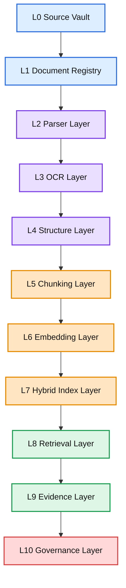
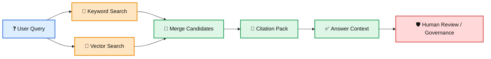

# 🧠 AndyAI RAG Ingestion Factory

> **A canonical AndyAI document-ingestion factory for large PDF libraries.**  
> Turn raw PDFs into **structured chunks, searchable indexes, retrieval evidence, and citable answers**.

<p align="left">
  
  
  
  
  
  
</p>

---

## 🧭 What This Repo Is

**AndyAI RAG Ingestion Factory** is a production-oriented repository for building a serious RAG ingestion pipeline for **very large PDF collections**.

It is designed for scenarios such as:

- **100–200 PDFs**
- **1,000 pages per PDF**
- **100,000–200,000 total pages**
- **hundreds of thousands of searchable chunks**
- **page-level citations**
- **hybrid retrieval**
- **human-verifiable evidence**

---

## 🧠 Canonical Principle

Raw documents are **not knowledge**.

They become useful only after they pass through a governed ingestion factory:

```text
PDF → Register → Parse → Normalize → Structure → Chunk → Embed → Index → Validate → Retrieve → Cite
```

### Canonical Formula

```text
Raw file enters.
Factory controls it.
Chunks become evidence.
Indexes become memory.
Retrieval returns proof.
Human keeps authority.
```

### Canonical Slogan

```text
No ingestion discipline, no RAG truth.
```

---

## 🎨 AndyAI Visual Canon

This repo follows the **AndyAI Visual Canon**:

- 🔵 **Blue** = registry / source / metadata
- 🟣 **Purple** = parser / OCR / structure
- 🟠 **Orange** = chunking / embedding / index
- 🟢 **Green** = retrieval / evidence / validation
- 🔴 **Red** = governance / risk / failure

See full standard here:

- [`docs/09-visual/ANDYAI_VISUAL_CANON.md`](docs/09-visual/ANDYAI_VISUAL_CANON.md)

---

## 🏗️ Factory Architecture

```mermaid
flowchart LR
  A[📄 PDF Library]:::blue --> B[🧾 Document Registry]:::blue
  B --> C[⚙️ Ingestion Orchestrator]:::purple
  C --> D[📥 Parser Layer]:::purple
  C --> E[🔍 OCR Layer]:::purple
  D --> F[🧩 Structured Elements]:::purple
  E --> F
  F --> G[✂️ Chunking Layer]:::orange
  G --> H[🧠 Embedding Layer]:::orange
  G --> I[🔎 Keyword Index]:::orange
  H --> J[📦 Vector Index]:::orange
  J --> K[🔀 Hybrid Retrieval]:::green
  I --> K
  K --> L[📌 Citation Pack]:::green
  L --> M[✅ Answer Context]:::green
  M --> N[🛡️ Governance / Human Review]:::red

  classDef blue fill:#DCEEFF,stroke:#2F6FDB,stroke-width:2px,color:#111;
  classDef purple fill:#EADFFF,stroke:#7B3FE4,stroke-width:2px,color:#111;
  classDef orange fill:#FFE5C2,stroke:#E68A00,stroke-width:2px,color:#111;
  classDef green fill:#DDF6E5,stroke:#1F9D55,stroke-width:2px,color:#111;
  classDef red fill:#FFD9D9,stroke:#D64545,stroke-width:2px,color:#111;
```



---

## 🧱 Factory Layers



---

## 📥 Ingestion Pipeline

An **ingestion pipeline** is the controlled production line that transforms raw files into searchable and citable knowledge blocks.


---

## ✂️ Chunking Logic

The current local MVP uses **page-aware chunking**.

Default v1 settings:

- `max_chars = 2400`
- `overlap_chars = 250`

Every chunk includes:

- `chunk_id`
- `document_id`
- `file_name`
- `page_start`
- `page_end`
- `section_title`
- `chunk_index`
- `text`
- `text_hash`
- `created_at`

---

## 🔎 Retrieval and Evidence



### Citation Rule

```text
No citation pack, no trusted answer.
```

---

## 🧪 Local Demo

Run the local verification pass:

```bash
cd ~/Documents/Projects/andyai-rag-ingestion-factory
./scripts/verify.sh
```

Or install the CLI:

```bash
python3 -m venv .venv
source .venv/bin/activate
pip install -e .
andyai-rag ingest examples/sample_documents/demo_document.txt --out examples/output
```


---

## 📄 PDF Parser Adapter

v1.2.0 adds the first real PDF parser adapter.

```bash
python3 -m pip install pymupdf
PYTHONPATH=src python3 -m rag_ingestion_factory.cli.main ingest path/to/document.pdf --out examples/output/pdf_run
```

The adapter preserves page-level identity and feeds extracted pages into the same chunking, manifest, keyword index, and citation pipeline.


---

## 🗄️ PostgreSQL Metadata Layer

v1.3.0 adds the canonical database design for the ingestion factory.

PostgreSQL becomes the **system memory** for:

- documents
- ingestion runs
- chunks
- citation events
- index versions

Migration file:

```text
db/migrations/001_metadata_schema.sql
```

Canonical rule:

```text
Vector DB is search memory.
PostgreSQL is system memory.
Original file is source truth.
Citation pack is evidence truth.
```


---

## 🌍 Public Repo Metadata

**Repository positioning:**

```text
Production-grade RAG ingestion factory for large PDF libraries:
PDF parsing, page-aware chunking, PostgreSQL metadata, citations,
and hybrid retrieval architecture.
```

**Public canon:**

```text
Reliable RAG begins before retrieval.
Most RAG demos start with a chat box.
This repo starts with document control.
```

**Suggested GitHub topics:**

```text
rag · retrieval-augmented-generation · pdf-processing · document-ai
ingestion-pipeline · vector-search · qdrant · postgresql
metadata · citations · hybrid-search · llm · ai-engineering
knowledge-base · andyai
```

---

## 📁 Repo Structure

```text
docs/
  00-canon/
  01-architecture/
  02-ingestion/
  03-retrieval/
  04-governance/
  05-ops/
  06-roadmap/
  07-cli/
  08-examples/
  09-visual/
examples/
src/
tests/
scripts/
schemas/
.github/workflows/
```

---

## 🛡️ Governance Rules

- never lose **document identity**
- never lose **page identity**
- never lose **chunk identity**
- never skip **manifests**
- never trust answers without **citations**
- never hide ingestion failure
- never confuse extracted text with verified truth

---

## 🗺️ Roadmap

- **v1.1.1** — full core MVP + visual canon rescue
- **v1.2.0** — real PDF parser adapter ✅
- **v1.3.0** — PostgreSQL metadata layer ✅
- **v1.4.0** — Qdrant vector index adapter
- **v1.5.0** — hybrid retrieval engine
- **v1.6.0** — reranker + evidence pack
- **v2.0.0** — production governance layer

---

## 📚 Glossary

| Term | Meaning |
|---|---|
| **RAG** | Retrieval-Augmented Generation — answering with retrieved evidence |
| **Ingestion Pipeline** | Controlled document processing line |
| **Chunk** | Searchable block of document text |
| **Embedding** | Vector representation of meaning |
| **Hybrid Retrieval** | Vector + keyword + metadata search |
| **Citation Pack** | Evidence wrapper for retrieved chunks |
| **Manifest** | Run record of the ingestion process |

---

---

## 🤝 Contributing

See [`CONTRIBUTING.md`](CONTRIBUTING.md).

Good contributions improve:

- parser adapters
- metadata discipline
- chunk quality
- vector index adapters
- hybrid retrieval
- citation validation
- governance

---

## 🔐 Security

See [`SECURITY.md`](SECURITY.md).

Canonical rule:

```text
No permission boundary, no production RAG.
```


---

## 📦 v1.4.0 — Qdrant Vector Index Adapter

This repo now has a vector-index layer.

The current implementation includes:

- deterministic local embeddings for verification
- in-memory vector index
- Qdrant adapter contract
- future production payload design

Canonical rule:

```text
Qdrant is search memory.
PostgreSQL is system memory.
Original PDF is source truth.
Citation pack is evidence truth.
```


---

## 🔀 v1.5.0 — Hybrid Retrieval Engine

The repo now includes a local hybrid retrieval engine.

It combines:

- keyword search
- vector search
- candidate merging
- traceable metadata

Canonical rule:

```text
Vector finds meaning.
Keyword finds exactness.
Metadata proves identity.
Citation earns trust.
```


---

## 📌 v1.6.0 — Reranker + Evidence Pack

The repo now includes an evidence layer.

Retrieval candidates can be converted into:

- ranked evidence
- answer context
- citation dictionaries
- page-level source references

Canonical rule:

```text
Candidate is not evidence.
Evidence is candidate + source + page + chunk + score + reason.
```


---

## 🛡️ v2.0.0 — Governed RAG Ingestion Factory

v2.0.0 is the first complete architecture release.

The repo now includes:

- real PDF parser adapter
- page-aware chunking
- PostgreSQL metadata schema
- vector index layer
- hybrid retrieval engine
- reranker
- evidence pack
- governance audit log
- public repo polish

Final v2 formula:

```text
Parse carefully.
Chunk intelligently.
Index traceably.
Retrieve hybridly.
Rerank evidence.
Cite always.
Audit everything.
```

Production rule:

```text
No audit trail, no production answer.
```


## 👨‍💻 Founder

# 🧠 AndyAI

## Canonical AI platform, system direction, and brand layer

👨‍💻 **Founder**  
Andrija (Andy) Kolundzic

🏢 **Japan IT Business**  
CEO and Owner

📍 **Tokyo, Japan**
