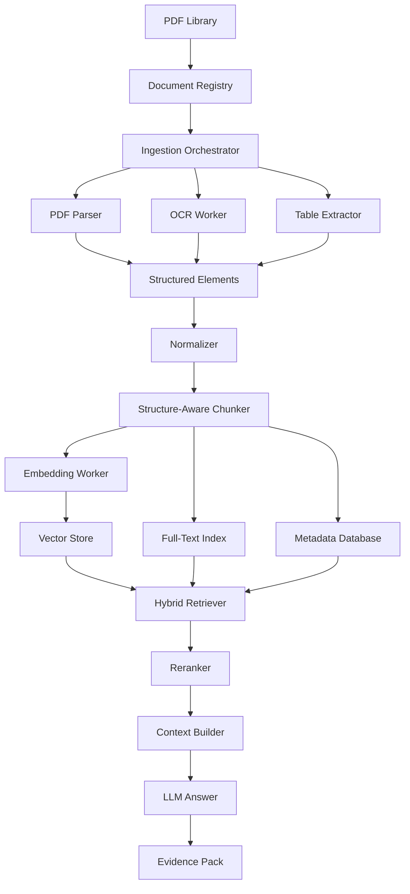

# Architecture

## System Overview



## Main Components

### Source Vault

Stores original PDFs and extracted artifacts.

### Document Registry

Tracks every file by hash, source, status, version, and ingestion run.

### Ingestion Orchestrator

Runs the pipeline as repeatable jobs.

### Parser Layer

Extracts text, headings, page blocks, tables, and layout signals.

### OCR Layer

Handles scanned PDFs and low-quality pages.

### Structure Layer

Preserves hierarchy:

```text
document → chapter → section → page → element → chunk
```

### Chunking Layer

Creates stable, metadata-rich chunks.

### Index Layer

Stores vectors, keyword index, and metadata.

### Retrieval Layer

Uses hybrid search, metadata filters, reranking, and evidence packing.

### Governance Layer

Tracks errors, quality, permissions, versions, and human review.
