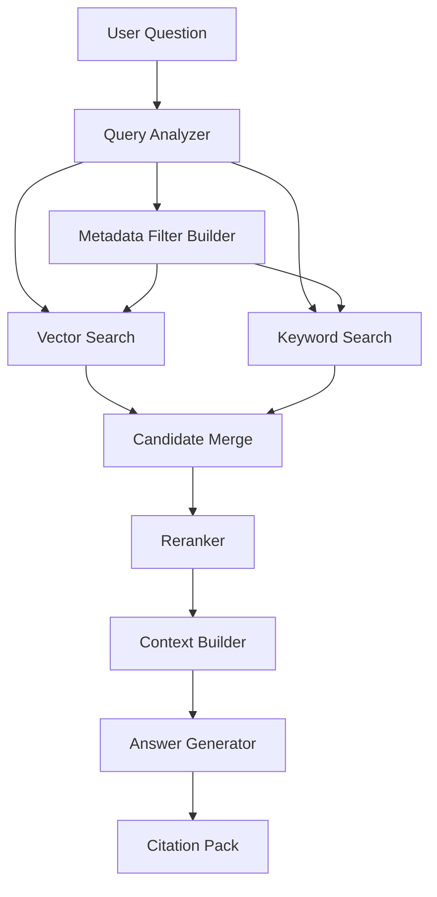

# Retrieval Design

## Retrieval Flow



## Why Hybrid Retrieval

Vector search finds meaning.

Keyword search finds exact terms.

Metadata filters control scope.

Reranking improves final selection.

Together they are stronger than any one method alone.

## Required Retrieval Output

Each selected chunk must include:

```text
document_id
file_name
page_start
page_end
section_title
chunk_id
score
retrieval_method
index_version
```

## Answer Policy

No citation, no final answer.

If the system cannot find enough evidence, it must say so.
