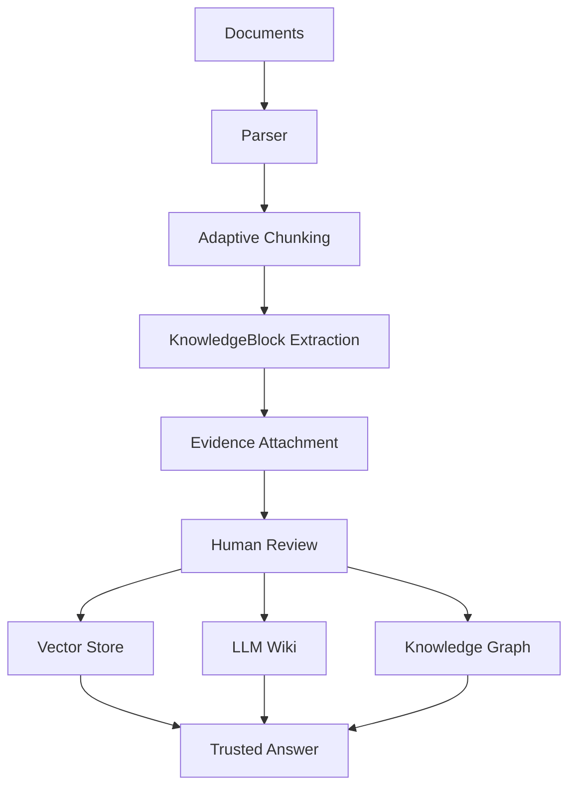
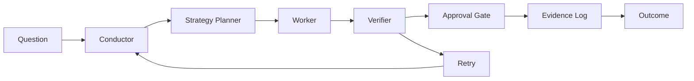
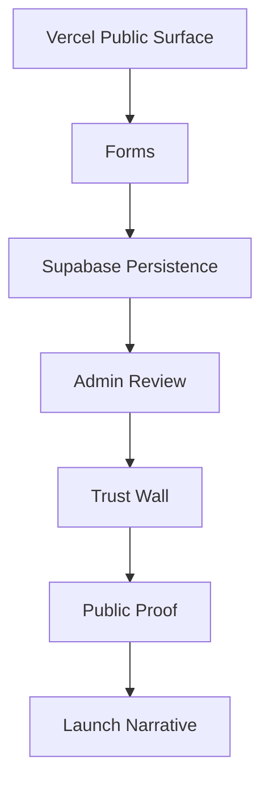
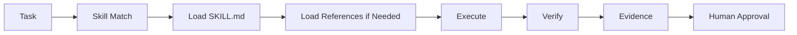

# 🧭 Mermaid Architecture Suite

## 1. End-to-end Knowledge Factory

```mermaid
flowchart TD
  A[Documents] --> B[Parser]
  B --> C[Adaptive Chunking]
  C --> D[KnowledgeBlock Extraction]
  D --> E[Evidence Attachment]
  E --> F[Human Review]
  F --> G[Vector Store]
  F --> H[LLM Wiki]
  F --> I[Knowledge Graph]
  G --> J[Trusted Answer]
  H --> J
  I --> J
```

## 2. Conductor orchestration

```mermaid
flowchart LR
  Q[Question] --> C[Conductor]
  C --> S[Strategy Planner]
  S --> W[Worker]
  W --> V[Verifier]
  V --> A[Approval Gate]
  A --> E[Evidence Log]
  E --> O[Outcome]
  V --> R[Retry]
  R --> C
```

## 3. Public beta system

```mermaid
flowchart TD
  V[Vercel Public Surface] --> F[Forms]
  F --> S[Supabase Persistence]
  S --> A[Admin Review]
  A --> T[Trust Wall]
  T --> P[Public Proof]
  P --> L[Launch Narrative]
```

## 4. Skill-ready future layer

```mermaid
flowchart LR
  T[Task] --> M[Skill Match]
  M --> K[Load SKILL.md]
  K --> R[Load References if Needed]
  R --> X[Execute]
  X --> V[Verify]
  V --> E[Evidence]
  E --> H[Human Approval]
```
