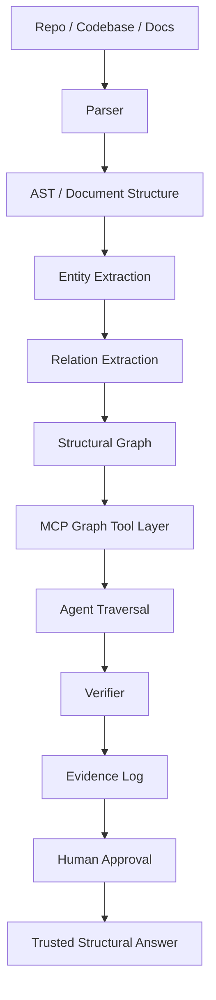
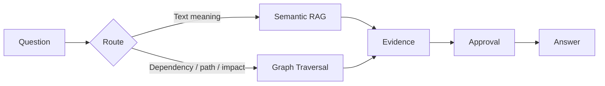

# ASAL Mermaid Architecture

```mermaid
flowchart TD
  A[Repo / Codebase / Docs] --> B[Parser]
  B --> C[AST / Document Structure]
  C --> D[Entity Extraction]
  D --> E[Relation Extraction]
  E --> F[Structural Graph]
  F --> G[MCP Graph Tool Layer]
  G --> H[Agent Traversal]
  H --> I[Verifier]
  I --> J[Evidence Log]
  J --> K[Human Approval]
  K --> L[Trusted Structural Answer]
```

```mermaid
flowchart LR
  Q[Question] --> R{Route}
  R -->|Text meaning| V[Semantic RAG]
  R -->|Dependency / path / impact| G[Graph Traversal]
  V --> E[Evidence]
  G --> E
  E --> A[Approval]
  A --> O[Answer]
```
